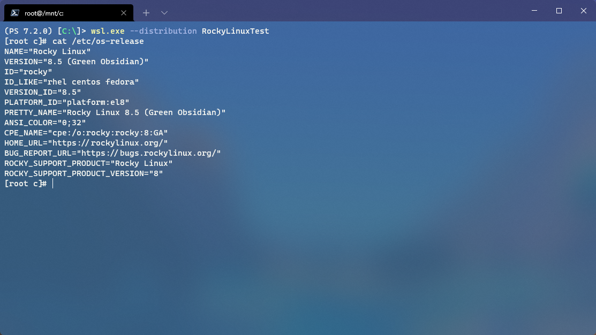

# RockyLinux WSL Image Creator



This is a simple Windows Subsystem for Linux (WSL) image creator for RockyLinux. Ever since CentOS was changed from being a downstream replica of Red Hat Enterprise Linux (RHEL) to being an upstream source for RHEL, I've been wanting to get a CentOS replacement instance set up to play around with. RockyLinux is one of the CentOS replacements that I've chosen to use for personal projects. Using WSL2 is a perfect solution for running a lightweight Linux VM for testing things, but there isn't an official RockyLinux distribution available in the Microsoft Store. This script will build the barebones RockyLinux image file to use with WSL.

Depending on how far I want to take this, [I may also create the code for the UWP app to import the distro](https://docs.microsoft.com/en-us/windows/wsl/build-custom-distro). This provides some extra functionality, such as an onboarding portion when starting the WSL VM for the first time. Since I'm not a maintainer of the distro, I wouldn't be publishing it to the Microsoft Store.

In addition, **no files** of the distro will be distributed through this repo. This is only meant to help create an image of RockyLinux locally.

For more info on how to import a custom Linux distribution for WSL, [check out this document from Microsoft](https://docs.microsoft.com/en-us/windows/wsl/use-custom-distro).

## 🧰 Prerequisites

- **A Linux-based Operating System**
  - This can be from a physical system, a virtual machine, or another WSL instance on your computer.
- **Packages installed on the system:**
  - A container platform
    - Docker
      - `docker`
        - [Install instructions](https://docs.docker.com/engine/install/#server)
        - ⚠️ **Warning:** I have not tested `docker` yet. This has been tested with `podman` and `buildah`.
    - Podman/Buildah
      - `podman`
        - [Install instructions](https://podman.io/getting-started/installation#linux-distributions)
      - `buildah`
        - [Install instructions](https://github.com/containers/buildah/blob/main/install.md)

## 🔨 Build the image

⚠️ **Note:** If you're intending to run this on an existing WSL instance, I would suggest cloning the repo to Windows and running the script from that location inside of the WSL instance. It will remove the step of copying the output file. For example, it would be located somewhere in `/mnt/c/` in the WSL instance (Relative to where you cloned the repo to). 

On your Linux host:

1. Navigate to the cloned repo folder on your local machine in a terminal.
2. Run `./createRockyLinuxImage.sh`
    - If needed, you may need to run `chmod +x ./createRockyLinuxImage.sh` to allow it to execute.
3. Once the script finishes, it outputs the file to `./out/rockylinux-latest.tar` in the cloned repo directory.

Make sure you copy the `rockylinux-latest.tar` file to your Windows host.

## ▶️ Using the image

On your Windows host:

1. Launch a command prompt or PowerShell console.
2. Run the following command: `wsl.exe --import "RockyLinux" "C:\path\to\dir\" "C:\path\to\rockylinux-latest.tar"`
    - The first argument is the name you want to call the distribution.
    - The second argument is the path to store the WSL VM's `.vhdx` file.
    - The third argument is the path where the `.tar` file is located.
3. You can now launch a terminal to the distribution by running `wsl.exe --distribution "RockyLinux"`.

### 💻 Windows Terminal profile

After importing the distribution, you can add this to your Windows Terminal settings JSON file to make it easier to access (If it doesn't add it automatically).

In the `list` array under the `profiles` object, add this to the list:

```json
{
    "guid": "{57929474-3280-5c1a-a51c-b17c2c28a426}",
    "hidden": false,
    "name": "RockyLinux",
    "source": "Windows.Terminal.Wsl"
}
```

### 🤔 Things to do after importing

- I would set up a user account for the image. [Check out this section in the WSL documentation](https://docs.microsoft.com/en-us/windows/wsl/use-custom-distro#add-wsl-specific-components-like-a-default-user) for details on how to configure it.
